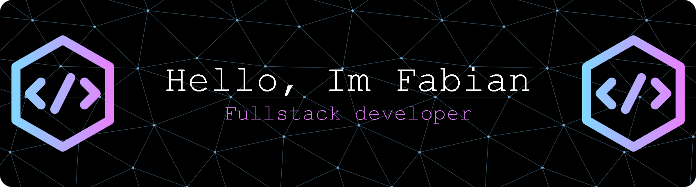

<!-- ===================================================
     HEADER SECTION (BANNER & LOGO)
     =================================================== -->

  <!-- BANNER HEADER -->
  
  
   
   

  <!-- JUDUL UTAMA & TAGLINE -->
  <h1>Halo 👋, Saya M. Fabian Khusyaeri</h1>
  <h3>🚀 Software Developer | Flutter & Laravel Specialist | SMK TI Garuda Nusantara Student </h3>

  <!-- BADGES SOSIAL MEDIA (BISA DIKLIK) -->
  

    
    
    
  

  <!-- PENGUNJUNG REPO (DINAMIS) -->
  

<!-- ===================================================
     TENTANG SAYA
     =================================================== -->
## 🧑‍💻 Tentang Saya

Saya adalah seorang siswa vokasi dan *software developer* dari **Bandung, Indonesia 🇮🇩**. Saya fokus pada pengembangan aplikasi *mobile* menggunakan **Flutter**, serta pembuatan aplikasi web modern berbasis **Laravel**.

- 🌱 Saya sedang mendalami **Flutter, Dart, Laravel, Firebase, & AI Integration**
- 🛠️ Pengalaman mengerjakan proyek aplikasi berbasis **Flutter, Laravel, PHP, dan Java NetBeans**
- 💬 Tanya saya tentang **Flutter, Laravel, PHP, Setup Peripheral, atau Rubik's Cube**
- ⚡ Fakta menyenangkan: Suka dengan setup keyboard kustom, *tactical/simulation gaming*, dan memecahkan Rubik's Cube.

<!-- ===================================================
     TEKNOLOGI (BADGES TECH STACK)
     =================================================== -->
## 🛠️ Tech Stack (Keahlian)

Beberapa framework, teknologi, dan bahasa pemrograman yang sering saya gunakan:

### 📱 Mobile & Web Frameworks

  
  
  
  
  
  
  
  

### 🔙 Backend & Database

  
  
  

### 🔧 Tools & Workflow

  
  
  
  

<!-- ===================================================
     STATISTIK GITHUB (DINAMIS & OTOMATIS UPDATE)
     =================================================== -->
## 📊 Statistik GitHub

  
  

  

<!-- ===================================================
     AKTIVITAS KONTRIBUSI (ANIMASI GAME)
     =================================================== -->
## 🎮 Aktivitas Kontribusi

Visualisasi kontribusi repositori GitHub saya dalam bentuk animasi game:

### 🐍 Snake Animation Contribution Graph

### 🕹️ Pacman Contribution Graph
<picture data-importer="pacman">
  <source media="(prefers-color-scheme: dark)" srcset="https://raw.githubusercontent.com/fabiankhusyaeri-hub/fabiankhusyaeri-hub/pacman-output/pacman-contribution-graph-dark.svg?game=pacman">
  <source media="(prefers-color-scheme: light)" srcset="https://raw.githubusercontent.com/fabiankhusyaeri-hub/fabiankhusyaeri-hub/pacman-output/pacman-contribution-graph.svg?game=pacman">
  
</picture>

<!-- ===================================================
     FOOTER
     =================================================== -->

  Dibuat dengan ❤️ oleh <a href="https://github.com/fabiankhusyaeri-hub">M. Fabian Khusyaeri</a>.

